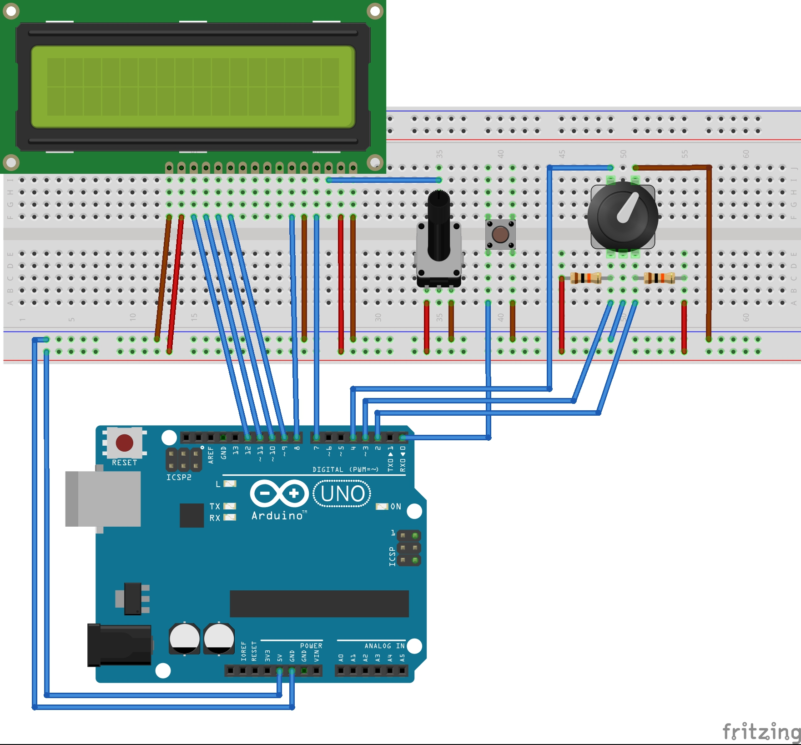

# LRduino

LRduino is designed to be an open-source modular controller for photo post-processing software, such as Lightroom. Use buttons, rotary encoders, potentiometers and any other interface to offer ultimate control over your photo editing.

LRduino is initially designed for use on Arduino, and is currently in very early stages of development.

## Prerequisites
LRduino depends on a number of tools to convert incoming serial into MIDI, which can then be interpreted by Lightroom:
- [Hairless-MIDIserial](https://github.com/projectgus/hairless-midiserial)
- [LoopMIDI](https://www.tobias-erichsen.de/software/loopmidi.html)
- [MIDI2LR](https://rsjaffe.github.io/MIDI2LR/)

In future iterations of this project, the intention is to output MIDI directly over USB (e.g. Teensy), negating the need for the Hairless-MIDIserial and LoopMIDI software.

## Setup
Clone this library and upload the LRduino.ino example to your Arduino UNO. The Baud Rate is 115200.

The following wiring diagram will offer two interfaces to Lightroom:
- A button, which selects the adjustment to be made (e.g. exposure, shadow, etc.). The selected adjustment is shown on the LCD.
- A clickable rotary encoder (far right), which changes the value for the selected adjustment (e.g. exposure +0.5, shadow -10). Clicking the encoder resets the selected adjustment to the original value.

The rotary potentimeter (middle) changes the brightness of the LCD screen.

Once this is setup, open LoopMIDI and open a port. 

Open Hairless-MIDIserial and change the Baud rate to 115200 in the preferences. Select the Arduino UNO as an input, and the LoopMIDI port as an output. Tick "Debug MIDI Messages" and turn the rotary encoder - you should see:

`+1.0 - Serial In: Ch 1: Controller 127 value 64`

The value will change as you turn the encoder - this represents the selected adjustment value.

Clicking the button will cycle the Channel `Ch` - this represents the selected adjustment. By default, 5 adjustments are available to be mapped - these can be configured in LRduino.ino:

`String adj[] = {"Exposure", "Contrast", "Brightness", "Shadows", "Highlights"};`

Open Lightroom and the MIDI2LR plugin. Turn the encoder, and map the input shown on MIDI2LR to the Lightroom adjustment shoown on the LCD. Click the button and repeat this process until all inputs channels are mapped. 

Open a photo, and start editing!

## License

LRduino - The open-source modular controller for photo post-processing

Copyright (C) 2018  Ben Trew

This program is free software: you can redistribute it and/or modify
it under the terms of the GNU General Public License as published by
the Free Software Foundation, either version 3 of the License, or
(at your option) any later version.

This program is distributed in the hope that it will be useful,
but WITHOUT ANY WARRANTY; without even the implied warranty of
MERCHANTABILITY or FITNESS FOR A PARTICULAR PURPOSE.  See the
GNU General Public License for more details.

You should have received a copy of the GNU General Public License
along with this program.  If not, see <http://www.gnu.org/licenses/>.

https://github.com/Bixx
